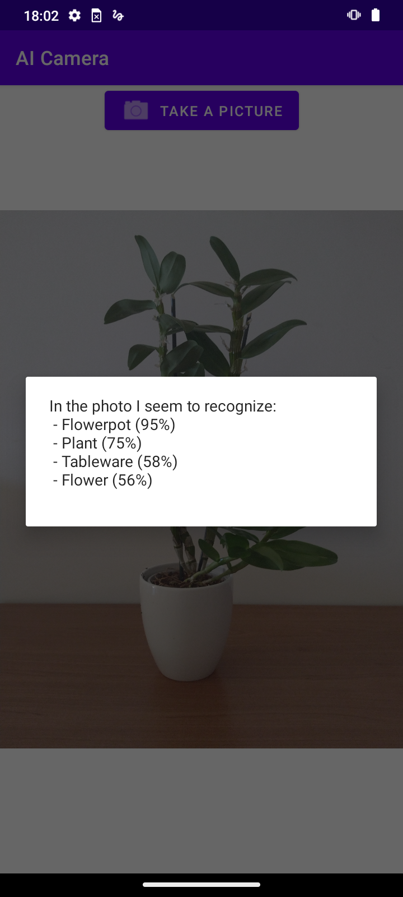
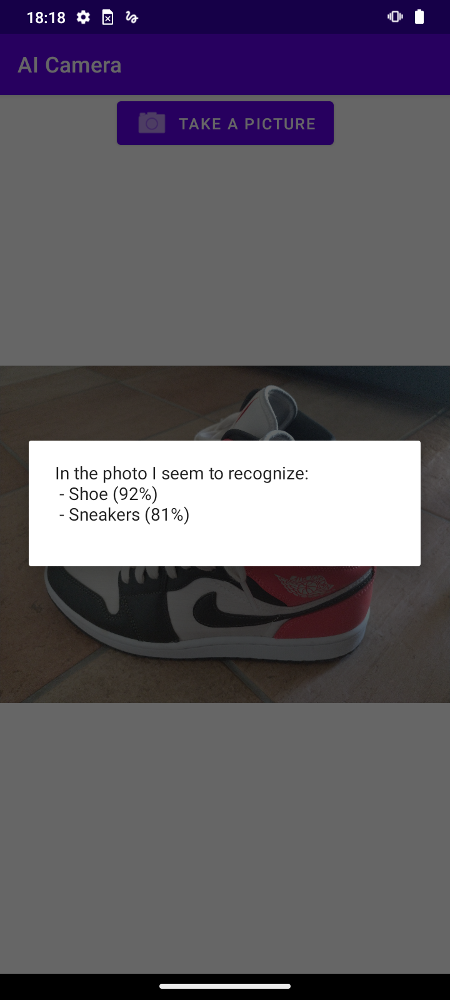

# AI Camera
Android app that uses AI to recognize the contents of a photo.

## Screenshots

<a href="https://github.com/ncant04/AI-Camera">
   
</a>
<a href="https://github.com/ncant04/AI-Camera">
   
</a>

## Dependencies
ML Kit (image labeling)
   ```sh
   implementation 'com.google.mlkit:image-labeling:17.0.7'
   ```
